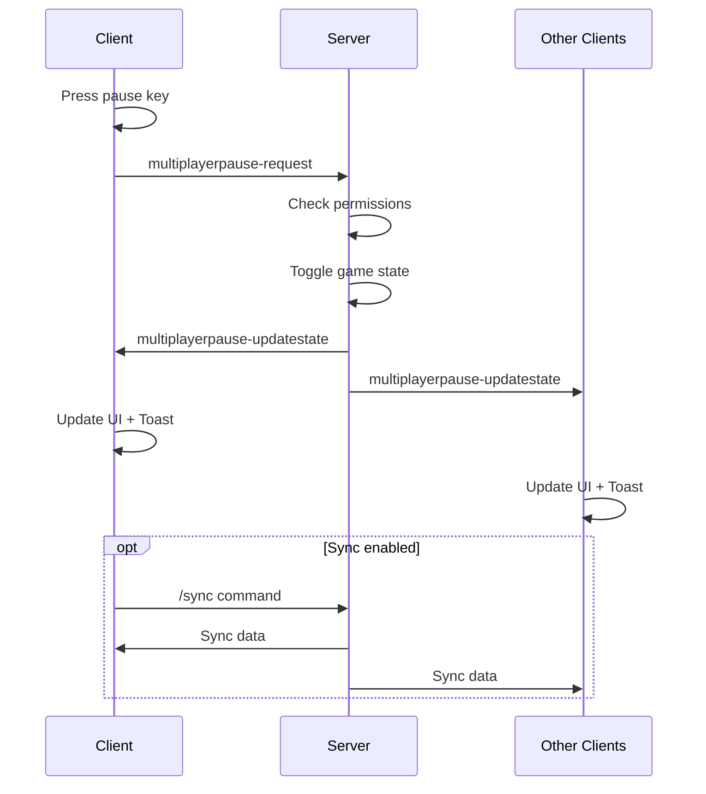
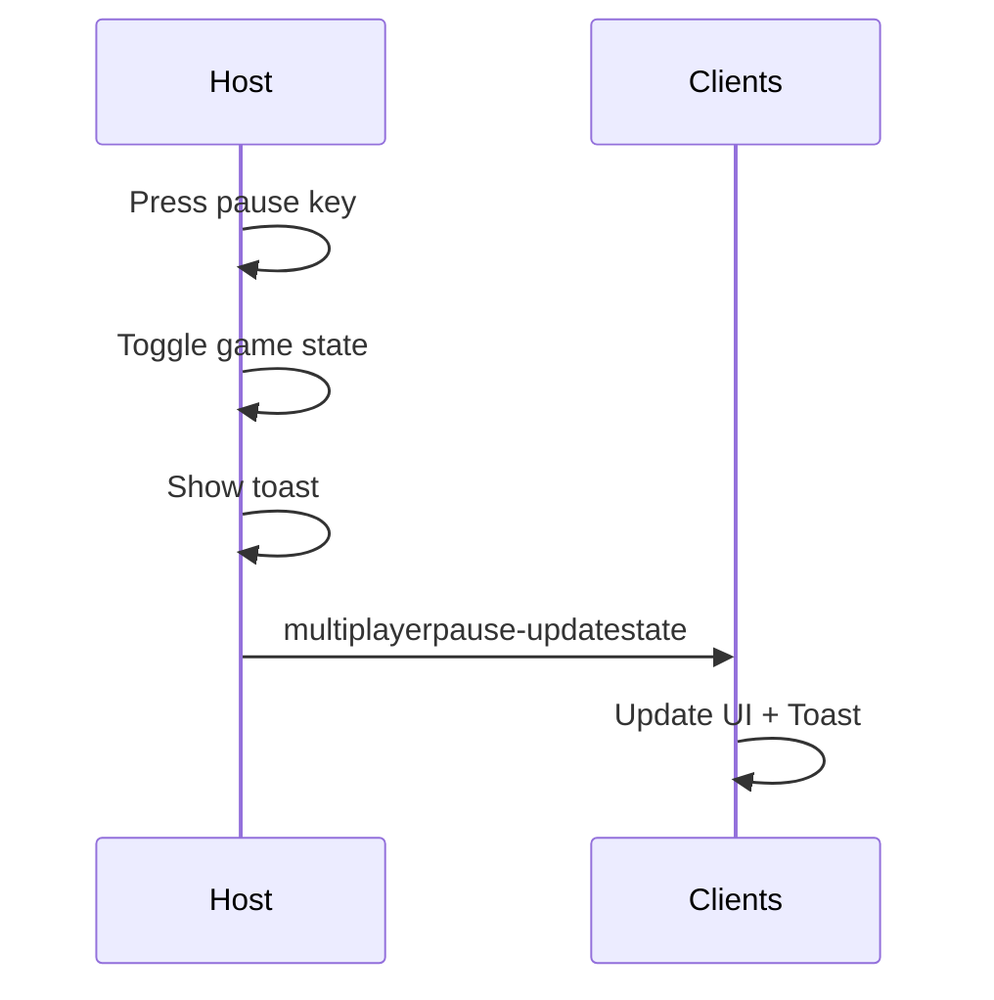

# API Documentation

Tài liệu kỹ thuật về cơ chế hoạt động và API của Multiplayer Pause Mod.

## 📡 Packet Handlers

Mod sử dụng custom packet handlers để đồng bộ trạng thái pause giữa server và clients.

### Client → Server Packets

#### `multiplayerpause-request`

**Mô tả**: Client gửi yêu cầu pause/unpause game đến server.

**Trigger**: Khi người chơi nhấn phím pause.

**Data**: Empty string `""`

**Flow**:
```
Client nhấn pause key
    ↓
Kiểm tra điều kiện (không trong cutscene, dialog, etc.)
    ↓
Gửi packet "multiplayerpause-request" đến server
```

**Code Reference**:
```java
if (net.client()) {
    Call.serverPacketReliable("multiplayerpause-request", "");
}
```

---

### Server → Client Packets

#### `multiplayerpause-updatestate`

**Mô tả**: Server thông báo thay đổi trạng thái pause đến tất cả clients.

**Trigger**: Khi server nhận request pause hoặc host tự pause.

**Data Format**: `"<playerID> <paused>"`
- `playerID`: ID của người chơi pause (integer)
- `paused`: `"t"` (true) hoặc `"f"` (false)

**Example**: `"42 t"` - Player ID 42 đã pause game

**Flow**:
```
Server nhận pause request
    ↓
Kiểm tra quyền (admin hoặc allow-any setting)
    ↓
Toggle game state (paused ↔ playing)
    ↓
Broadcast "multiplayerpause-updatestate" đến tất cả clients
    ↓
Clients cập nhật UI và hiển thị toast
```

**Code Reference**:
```java
// Server side
Call.clientPacketReliable("multiplayerpause-updatestate", 
    p.id + " " + (paused ? "t" : "f"));

// Client side
netClient.addPacketHandler("multiplayerpause-updatestate", data -> {
    String[] d = data.split(" ");
    boolean paused = d[1].equals("t");
    state.set(paused ? GameState.State.paused : GameState.State.playing);
    showToast(Groups.player.getByID(Strings.parseInt(d[0])), paused);
});
```

---

## 🔄 Synchronization Mechanism

### Tại sao cần sync?

Khi game pause/unpause, có thể xảy ra desync giữa clients do:
- Network latency
- Packet loss
- Timing differences

### Auto-Sync Features

Mod cung cấp 3 tùy chọn sync:

#### 1. Sync on Pause
```java
if (Core.settings.getBool("multiplayerpause-synconpause")) {
    Call.sendChatMessage("/sync");
}
```

#### 2. Sync on Unpause
```java
if (Core.settings.getBool("multiplayerpause-synconunpause")) {
    Call.sendChatMessage("/sync");
}
```

#### 3. Schedule Sync

Nếu sync gần đây đã được thực hiện (< 5.1s), lên lịch sync sau:

```java
if (Core.settings.getBool("multiplayerpause-schedulesync")) {
    long since = Time.millis() - lastSyncTime;
    if (since > 5100) {
        // Sync ngay
        Call.sendChatMessage("/sync");
        lastSyncTime = Time.millis();
    } else if (since > 0) {
        // Lên lịch sync
        Timer.schedule(() -> Call.sendChatMessage("/sync"), 
            (5100 - since) / 1000f);
        lastSyncTime = Time.millis() + 5100 - since;
    }
}
```

**Cooldown**: 5.1 giây giữa các lần sync để tránh spam.

---

## 🎮 Game State Management

### State Transitions

```mermaid
stateDiagram-x
    [*] --> Playing
    Playing --> Paused: Pause Request
    Paused --> Playing: Unpause Request
    
    note right of Paused
        GameState.State.paused
    end note
    
    note right of Playing
        GameState.State.playing
    end note
```

### Permission Check

```java
// Server-side permission check
if (!(p.admin || Core.settings.getBool("multiplayerpause-allowany"))) {
    return; // Reject request
}

if (state.isMenu()) {
    return; // Cannot pause in menu
}
```

**Điều kiện pause**:
- ✅ Player là admin, HOẶC
- ✅ Setting "Allow Any" được bật
- ✅ Game đang chơi (không ở menu)

---

## 🔔 Toast Notifications

### Show Toast Logic

```java
void showToast(Player p, boolean paused) {
    // Server forwards state to clients
    if (net.server()) {
        Call.clientPacketReliable("multiplayerpause-updatestate", 
            p.id + " " + (paused ? "t" : "f"));
    }
    
    // Check if toasts are enabled
    if (!Core.settings.getBool("multiplayerpause-toasts")) return;
    
    // Format and display toast
    String playerName = p == null ? 
        "[lightgray]Unknown player[]" : 
        Strings.stripColors(p.name);
    String action = paused ? "paused" : "unpaused";
    
    Menus.infoToast(
        Strings.format("@ @ the game.", playerName, action), 
        2f // Duration: 2 seconds
    );
}
```

### Toast Format

```
<PlayerName> paused the game.
<PlayerName> unpaused the game.
```

**Features**:
- Strip color codes từ player name
- Hiển thị "Unknown player" nếu player null
- Duration: 2 giây
- Có thể tắt qua settings

---

## 🎯 Event Handling

### Update Event

Mod hook vào `Trigger.update` để lắng nghe pause key:

```java
Events.run(Trigger.update, () -> {
    // Check if pause key is pressed
    if (Core.input.keyTap(Binding.pause) 
        && !renderer.isCutscene() 
        && !scene.hasDialog() 
        && !scene.hasKeyboard() 
        && !ui.restart.isShown() 
        && state.isGame() 
        && net.active()) {
        
        if (net.client()) {
            // Client: send request to server
            Call.serverPacketReliable("multiplayerpause-request", "");
        } else {
            // Host: show toast directly
            showToast(player, !state.isPaused());
        }
    }
});
```

**Điều kiện trigger**:
- ✅ Pause key được nhấn
- ✅ Không trong cutscene
- ✅ Không có dialog mở
- ✅ Không có keyboard input active
- ✅ Restart UI không hiển thị
- ✅ Đang trong game
- ✅ Multiplayer active

---

## 🛠️ Settings API

### Available Settings

| Setting Key | Type | Default | Description |
|-------------|------|---------|-------------|
| `multiplayerpause-toasts` | boolean | `true` | Hiển thị toast notifications |
| `multiplayerpause-allowany` | boolean | `false` | Cho phép bất kỳ ai pause |
| `multiplayerpause-synconpause` | boolean | `false` | Auto sync khi pause |
| `multiplayerpause-synconunpause` | boolean | `false` | Auto sync khi unpause |
| `multiplayerpause-schedulesync` | boolean | `false` | Lên lịch sync nếu cần |

### Register Settings

```java
ui.settings.addCategory("Multiplayer Pause", Icon.pause, s -> {
    s.checkPref("multiplayerpause-toasts", true);
    s.checkPref("multiplayerpause-allowany", false);
    s.checkPref("multiplayerpause-synconpause", false);
    s.checkPref("multiplayerpause-synconunpause", false);
    s.checkPref("multiplayerpause-schedulesync", false);
});
```

### Access Settings

```java
// Get setting value
boolean toastsEnabled = Core.settings.getBool("multiplayerpause-toasts");

// Set setting value
Core.settings.put("multiplayerpause-toasts", false);
```

---

## 📊 Sequence Diagrams

### Pause Flow (Client)



### Pause Flow (Host)



---

## 🔍 Debugging

### Enable Debug Logging

Thêm logging vào code:

```java
// Log packet received
Log.info("Received pause request from player: @", p.name);

// Log state change
Log.info("Game state changed to: @", state.isPaused() ? "paused" : "playing");

// Log sync trigger
Log.info("Auto-sync triggered: @ ms since last sync", Time.millis() - lastSyncTime);
```

### Common Issues

1. **Pause không hoạt động**
   - Kiểm tra permissions (admin hoặc allow-any)
   - Verify cả hai players đã cài mod

2. **Desync sau pause**
   - Bật "Sync on Pause/Unpause"
   - Kiểm tra network latency

3. **Toast không hiển thị**
   - Verify setting "Toasts" đã bật
   - Check console logs

---

## 📚 References

- [Mindustry Modding Guide](https://mindustrygame.github.io/wiki/modding/)
- [Arc Framework Docs](https://github.com/Anuken/Arc)
- [Mindustry Source](https://github.com/Anuken/Mindustry)
